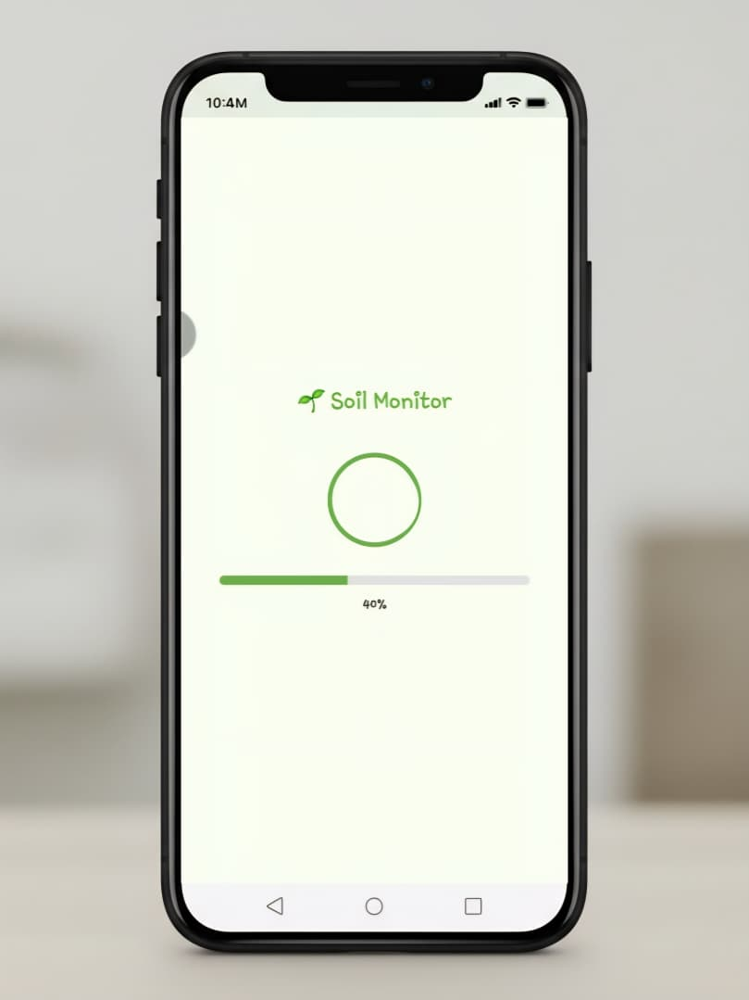
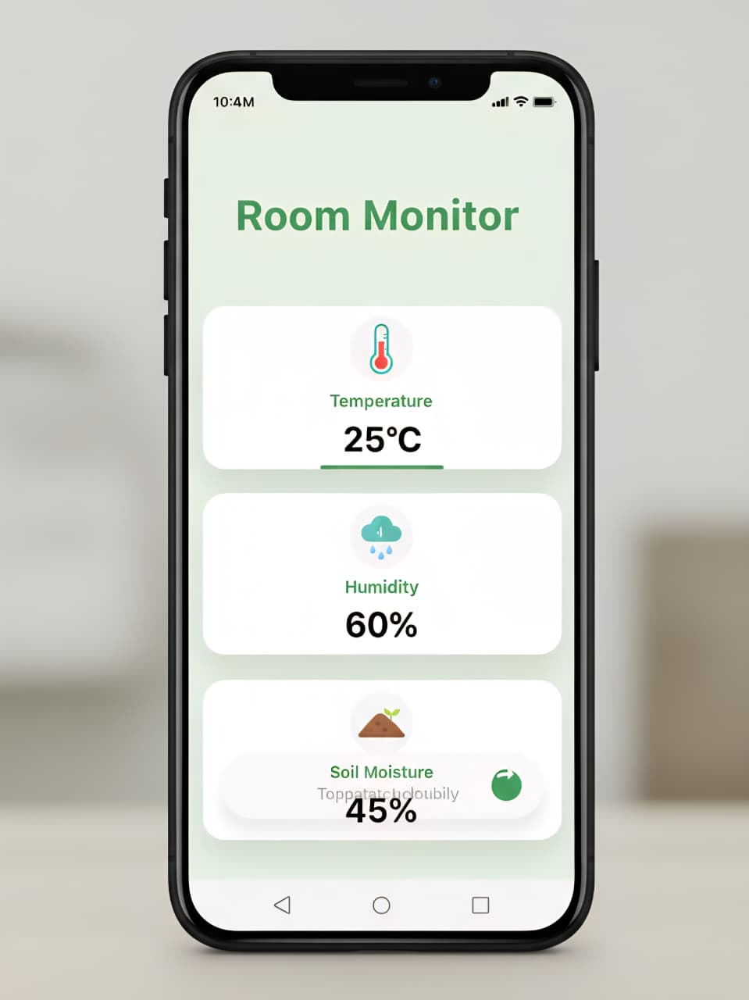

# 🌿 DrodXPlantWatering — Arduino-Powered Plant Monitoring & Watering System

**DrodXPlantWatering** is a smart IoT project that combines an **ESP32/Arduino** controller with environmental sensors and a mobile frontend (React Native / Expo). The system reads soil moisture and air humidity/temperature in real-time, logs data to a MySQL backend (optional), and allows remote activation of a water pump via a relay — either manually from an app or automatically based on soil moisture.

---

## ✨ Key Features

* 📊 Live soil moisture percentage and DHT11 humidity/temperature readings
* 🚰 Remote control of a water pump (relay) from a mobile app or HTTP request
* 🌱 Automated watering logic based on soil moisture thresholds
* 🔄 Optional data logging to a MySQL database (backend integration)
* 📱 Mobile-friendly UI with Expo + React Native (example client)
* 💧 One-tap manual watering via HTTP endpoint

---

## 🛠️ Tech & Hardware Stack

⚛️**Frontend (optional)**

* React Native (Expo)

🛠️**Controller & Sensors**

* ESP32 (or compatible Arduino board)
* DHT11 Temperature & Humidity sensor
* Soil moisture sensor (analog)
* 1-channel Relay module (to control a water pump)
* Water pump (12V or appropriate for your relay)
* LED indicator (optional)

🐬**Database / Backend (optional)**

* MySQL for data logging
* Java / Node / PHP backend to receive sensor data and store it

---

## 📦 Components Used

* ESP32 module
* DHT11 sensor
* Soil moisture sensor (analog) connected to an ADC pin
* Relay module (IN1) to switch the water pump
* Water pump (suitable power source)
* Jumper wires & breadboard

---

## 🧩 Wiring (reference)

* **DHT11** data pin → `DHTPIN` (default in sketch: GPIO 4)
* **Soil sensor** analog output → `SOIL_SENSOR_PIN` (default in sketch: GPIO 34)
* **Relay IN1** → `RELAY1_PIN` (default in sketch: GPIO 23)
* **LED** (optional) → `ledPin` (GPIO 2)
* **Power:** ensure the relay and pump use a suitable and isolated power supply. Do **not** power the pump from the ESP32.

---

## ⚙️ Arduino Sketch

> Paste this sketch into your Arduino IDE (select ESP32 board) and update `ssid` and `password`.

```cpp
#include <WiFi.h>
#include <Adafruit_Sensor.h>
#include <DHT.h>
#include <DHT_U.h>

// Define the GPIO pin where the DHT11 data pin is connected
#define DHTPIN 4       // Change this to the GPIO pin you're using
#define RELAY1_PIN 23  // GPIO pin connected to IN1 (K1)
int ledPin = 2;        // LED pin
#define SOIL_SENSOR_PIN 34

// Set the type of DHT sensor
#define DHTTYPE DHT11

// Initialize DHT sensor
DHT dht(DHTPIN, DHTTYPE);


const char* ssid = "";
const char* password = "";

// Adjust these based on your testing with dry and wet soil
int dryValue = 3000;  // Analog value when soil is completely dry
int wetValue = 1000;  // Analog value when soil is completely wet


// Placeholder for the network server, similar to WiFiServer on port 80
NetworkServer server(80);

void get_network_info() {
  if (WiFi.status() == WL_CONNECTED) {
    Serial.print("[*] Network information for ");
    Serial.println(ssid);

    Serial.println("[+] BSSID : " + WiFi.BSSIDstr());
    Serial.print("[+] Gateway IP : ");
    Serial.println(WiFi.gatewayIP());
    Serial.print("[+] Subnet Mask : ");
    Serial.println(WiFi.subnetMask());
    Serial.println((String) "[+] RSSI : " + WiFi.RSSI() + " dB");
    Serial.print("[+] ESP32 IP : ");
    Serial.println(WiFi.localIP());
  }
}

void setup() {
  Serial.begin(115200);
  dht.begin();

  pinMode(ledPin, OUTPUT);  // Set the LED pin as output
  pinMode(SOIL_SENSOR_PIN, INPUT);

  pinMode(RELAY1_PIN, OUTPUT);    // Set K1 pin as output
  digitalWrite(RELAY1_PIN, LOW);  // Ensure relay is OFF initially

  WiFi.begin(ssid, password);
  while (WiFi.status() != WL_CONNECTED) {
    delay(1000);
    Serial.println("Connecting to WiFi...");
  }

  Serial.println("Connected to Wi-Fi network");
  server.begin();  // Start the server (assuming server.begin() is supported in NetworkServer)
  Serial.println("Server started");
  get_network_info();
}

void loop() {
  // Placeholder for a network client connection, similar to WiFiClient
  NetworkClient client = server.accept();  // Assuming `accept` method exists in NetworkServer

  if (client) {
    Serial.println("Client connected");

    String requestText = "";

    while (client.connected()) {
      if (client.available()) {
        char c = client.read();
        requestText += c;

        if (c == '\n') {
          Serial.println("Request: " + requestText);

          if (requestText.startsWith("GET /?status=8")) {
            digitalWrite(ledPin, HIGH);  // Turn LED on

          } else if (requestText.startsWith("GET /temp")) {

            float humidity = dht.readHumidity();
            float temperature = dht.readTemperature();

            Serial.print("Humidity: ");
            Serial.print(humidity);
            Serial.print(" %\t");
            Serial.print("Temperature: ");
            Serial.print(temperature);
            Serial.println(" °C");


            if (isnan(humidity) || isnan(temperature)) {
              Serial.println("Failed to read from DHT sensor!");
              return;
            }

            String jsonResponse = "{\"temp\": " + String(temperature, 2) + ",\"humidity\":" + String(humidity, 2) + "}";

            client.println("HTTP/1.1 200 OK");
            client.println("Content-Type: text/plain");
            client.println("Connection:Close");
            client.println();
            // client.println(temperature);  // Example temperature value
            client.println(jsonResponse);


          } else if (requestText.startsWith("GET /water")) {

            int soilMoistureValue = analogRead(SOIL_SENSOR_PIN);

            // Map the soil moisture value to a percentage
            int soilMoisturePercent = map(soilMoistureValue, dryValue, wetValue, 0, 100);

            // Constrain the value to ensure it's between 0 and 100
            soilMoisturePercent = constrain(soilMoisturePercent, 0, 100);

            // Determine if the soil is dry, moist, or wet
            String moistureStatus;
            if (soilMoisturePercent < 30) {
              moistureStatus = "Dry";
            } else if (soilMoisturePercent > 70) {
              moistureStatus = "Wet";
            } else {
              moistureStatus = "Moist";
            }

            String jsonResponse = "{\"water\": " + String(soilMoisturePercent) + ",\"humidity\":\"" + moistureStatus + "\"}";

            // Print the result
            // Serial.print("Soil Moisture (%): ");
            // Serial.print(soilMoisturePercent);
            // Serial.print("% - ");
            // Serial.println(moistureStatus);


            client.println("HTTP/1.1 200 OK");
            client.println("Content-Type: text/plain");
            client.println("Connection:Close");
            client.println();
            // client.println(temperature);  // Example temperature value
            client.println(jsonResponse);


          } else if (requestText.startsWith("GET /?status=1")) {


            Serial.println("Water Start");
            digitalWrite(RELAY1_PIN, HIGH);  // Turn ON K1 (relay activated)


          } else {
            // digitalWrite(ledPin, LOW);  // Turn LED off
            digitalWrite(RELAY1_PIN, LOW);

            Serial.println("Water Stop");
          }

          break;
        }
      }
    }

    client.stop();  // Close the connection
    // Serial.println("Client disconnected");
  }
}
```

---

## 🔗 HTTP Endpoints (example)

* `GET /temp` → Returns JSON with current temperature & humidity:

  ```json
  { "temp": 29.50, "humidity": 60.30 }
  ```

* `GET /water` → Returns JSON with soil moisture percentage and status:

  ```json
  { "water": 42, "humidity": "Moist" }
  ```

* `GET /?status=1` → Turn ON the water pump (relay HIGH)

* `GET /?status=8` → Turn ON the onboard LED

* Any other request → Turns OFF the pump (relay LOW)

Example CURL command:

```bash
curl http://<ESP32_IP>/water
```

---

## 🧪 Calibration & Values

| Condition | Raw ADC Value (example) |
| --------- | ----------------------- |
| Dry soil  | ~3000                   |
| Wet soil  | ~1000                   |

These values are mapped to 0%–100% and used to determine `Dry` / `Moist` / `Wet` status. Adjust `dryValue` and `wetValue` in the sketch for your sensor and soil type.

---

## ⚠️ Safety & Notes

* Do **not** power the water pump directly from the ESP32 — use an external power supply and a properly rated relay or MOSFET.
* Ensure proper isolation and use flyback diodes if needed. Follow safe wiring practices when dealing with mains voltage.
* Consider adding debouncing or smoothing/filtering to analog readings for stable moisture values.
* The sketch uses placeholder `NetworkServer` / `NetworkClient` types. Replace these with `WiFiServer` / `WiFiClient` or appropriate network classes provided by your board's SDK.

---

## 🛠 Suggested Improvements

* Add scheduled automatic watering based on time windows and moisture thresholds.
* Secure communication using HTTPS or MQTT with authentication.
* Push sensor data to a backend (MySQL) for historical charts and analytics.
* Add OTA updates for the ESP32 sketch.
* Integrate push notifications to the mobile app when soil is too dry or when watering starts/stops.

---


## 📸 React App Screenshots


| Page                  | Preview                                                 |
| --------------------- | ------------------------------------------------------- |
| Splash Page           |                   |
| Sign In Page          |                  |
| Home Page             |                   |
| Soil Moisture Monitor |  |
| Humidity Monitor      |            |

---

## 👥 Contributors

* **Disandu Rodrigo** — Project author & maintainer

---

## 📜 License

This project is released under the **MIT License**.

---

🌿 Happy Gardening! 🚀
